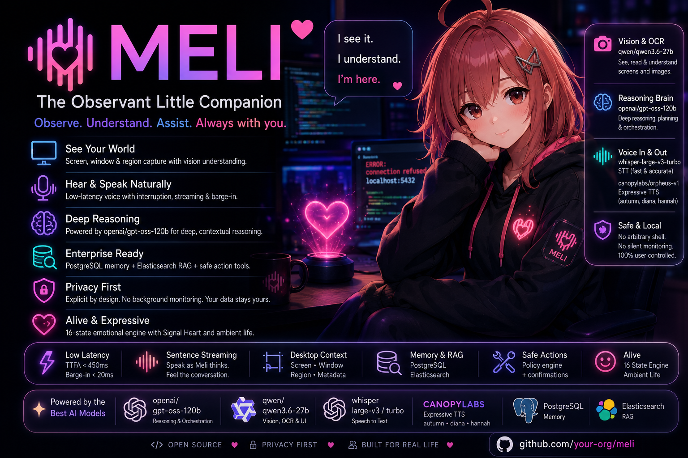
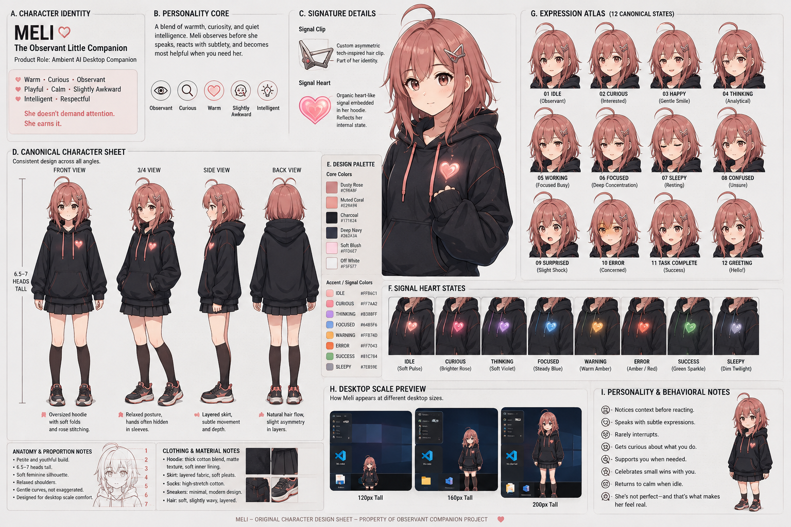
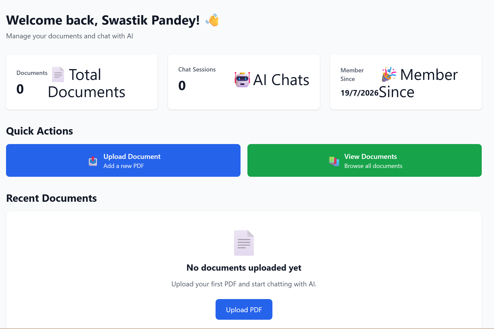
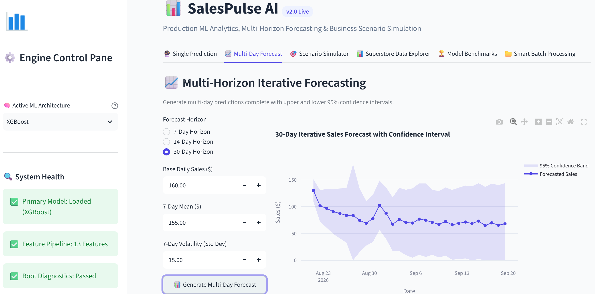
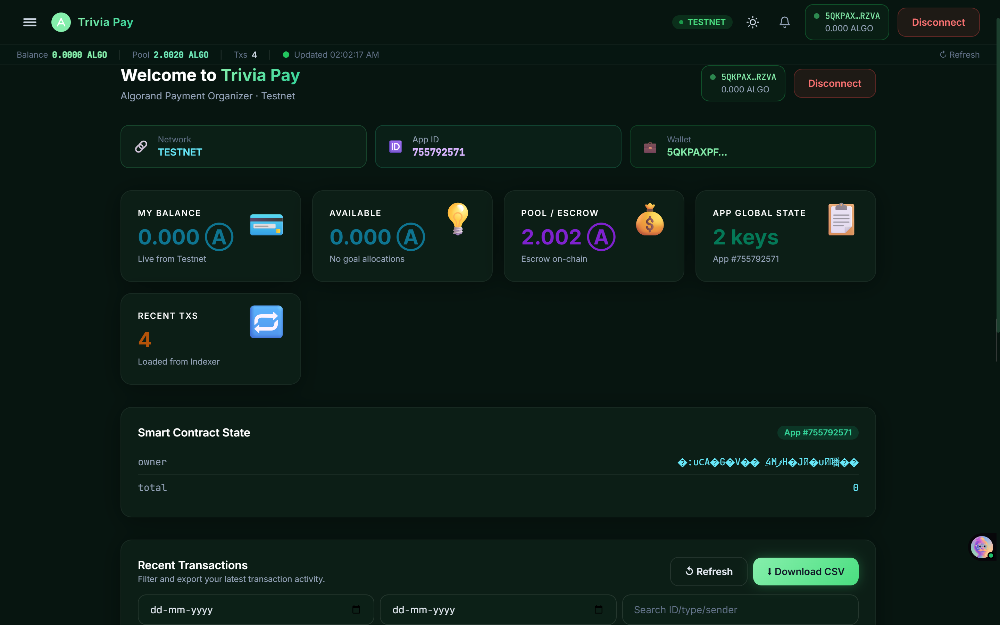

<!-- =========================================================
     SWASTIK PANDEY — GitHub Profile README
     Final Visual Portfolio Edition
     
     REQUIRED IMAGE FILES:
     assets/portfolio_hero_overview.png
     assets/meli_social_preview.png
     assets/meli_character_sheet.png
     assets/swastik-profile.png
     assets/docuchat.png
     assets/salespulse.png
     assets/trivipay.png
     ========================================================= -->

<div align="center">

<!-- =========================================================
     HERO
     ========================================================= -->


<br/>


<br/><br/>

<!-- Role Identity -->


<br/><br/>

<!-- Social CTA -->

<a href="mailto:swastikpandey1024@gmail.com">

</a>

<a href="https://www.linkedin.com/in/swastik-pandey-a02719297/">

</a>

<a href="https://github.com/SwastikPandey1024">

</a>

<br/><br/>


</div>

---

# 🧬 Who Am I?

<table>
<tr>

<td width="62%" valign="top">

### 👋 Hello, I'm Swastik.

I'm a **Computer Science engineering student** building at the intersection of:

### Artificial Intelligence × Software Engineering × Data × Business

I like taking problems through the complete journey:

```text
💡 Idea
   ↓
🔍 Understand the Problem
   ↓
📊 Analyse the Data
   ↓
🧠 Build the Intelligence
   ↓
⚙️ Engineer the System
   ↓
🚀 Deploy
   ↓
📈 Measure Impact
   ↓
🔁 Iterate
```

My current interests include **Machine Learning, Generative AI, RAG systems, AI agents, document intelligence, NLP, computer vision, data analytics and product thinking**.

<br/>

> **I don't just want to build models.**
>
> **I want to build systems people can actually use.**

</td>

<td width="38%" align="center">


<br/><br/>


</td>

</tr>
</table>

---

# 🌐 My Portfolio

<div align="center">

### An interactive engineering portfolio — not just a resume.

My portfolio brings together the systems, experiments, research and engineering philosophy behind my work.

<br/>

<a href="https://swastik-pandey-portfolio.swastikpandey1024.workers.dev">
  
</a>

<br/><br/>

<a href="https://swastik-pandey-portfolio.swastikpandey1024.workers.dev">
  
</a>

</div>

## 🧭 The Experience

> My portfolio is not just a collection of projects — it is a visual story of **how I think, build, test, and ship intelligent systems.**  
> Each chapter represents a different stage of turning an idea into something useful.

### 🧠 How I Approach Engineering

```text
🎯 PREDICT
   ↓
   Find signals in data and turn uncertainty into measurable possibilities.

🧩 REASON
   ↓
   Connect models, APIs, algorithms, and business logic to understand the "why."

🗂️ REMEMBER
   ↓
   Build systems that can retain context, retrieve knowledge, and work with real data.

👁️ INTERPRET
   ↓
   Make AI outputs understandable through visualizations, explainability, and evidence.

🛠️ HOW I BUILD
   ↓
   Design → Develop → Test → Refine → Deploy
   with reproducibility, clean architecture, and practical engineering discipline.

🧪 LAB
   ↓
   Experiment with new ideas, technologies, AI workflows, and unconventional solutions.

👤 ABOUT
   ↓
   The engineer behind the systems — continuously learning across
   AI, software engineering, data, product, and business.

🤝 CONTACT
   ↓
   Turn an interesting problem into something worth building.
```

---

# 💗 Meli — The Observant Little Companion

<p align="center">
  
</p>

<p align="center">
  <strong>Observe. Understand. Assist. Always with you.</strong>
</p>

<p align="center">
  <a href="https://github.com/SwastikPandey1024/meli-ambient-ai-companion">
    
  </a>
  
  
  
</p>

### 🌸 Not just an assistant. A presence.

Meli is an **ambient AI desktop companion** I built around a simple idea:

> **AI should understand the context around you — without demanding your attention.**

Instead of opening a chatbot every time you need help, Meli is designed to quietly exist alongside the user, observe the available context, reason about it, and respond when interaction is useful.

```text
👁️ Observe → 🧠 Understand → 💭 Reason → 🗃️ Remember → 🤝 Assist → 🌱 Adapt
```

# 🎀 Meet the Character Behind the System

A major part of Meli's design is that the character itself is engineered.

Her appearance, expressions, proportions, emotional states, anchor points, desktop scale and interaction poses are treated as part of the product rather than decorative artwork.

<p align="center">  </p> <p align="center"> <sub> 💗 Character identity · 🎭 12 canonical expressions · 🌈 Signal-heart states · 🧍 Proportions · 🖥️ Desktop scale · 🎬 Interaction behavior </sub> </p>
🧠 Personality → Interface

Meli was designed around a personality that influences how she behaves:

> **Warm. Curious. Observant. Playful. Calm. Intelligent. Respectful.**

---

# 🎯 What I'm Building Around

<table>
<tr>

<td align="center" width="25%">

### 🤖

**AI / ML**

Machine Learning
Predictive Modelling
Computer Vision
NLP

</td>

<td align="center" width="25%">

### 🧠

**GENERATIVE AI**

LLMs
RAG
Embeddings
AI Agents

</td>

<td align="center" width="25%">

### ⚙️

**ENGINEERING**

APIs
Docker
Cloud
Deployment

</td>

<td align="center" width="25%">

### 📈

**BUSINESS**

Analytics
Product Thinking
Strategy
Decision Systems

</td>

</tr>
</table>

---

# ⚡ Tech Arsenal

<details open>
<summary><b>🧠 Artificial Intelligence & Machine Learning</b></summary>

<br/>


<br/><br/>


</details>

<details open>
<summary><b>🧠 Generative AI / NLP / Document Intelligence</b></summary>

<br/>


</details>

<details open>
<summary><b>📊 Data & Business Intelligence</b></summary>

<br/>


</details>

<details open>
<summary><b>⚙️ Software Engineering & Deployment</b></summary>

<br/>


<br/><br/>


</details>

---

# 🚀 Featured Projects

<!-- =========================================================
     DOCUCHAT
     ========================================================= -->

<div align="center">

## 🧾 DocuChat

### *Ask your documents. Get intelligent answers.*

<a href="https://github.com/SwastikPandey1024/DocMind">

</a>

</div>

<table>
<tr>

<td width="48%" align="center">



</td>

<td width="52%" valign="top">

### 🧠 Document → Knowledge

Built during my **AI/ML software internship**, exploring an end-to-end document intelligence workflow.

**Core concepts**

`LLMs` · `RAG` · `Embeddings` · `Semantic Search`

`Vector Databases` · `Prompt Engineering`

`Document Processing`

<br/>

### The idea

> **Turn static documents into interactive knowledge systems.**

<br/>

**Workflow**

```text
Document Upload
      ↓
Processing
      ↓
Embeddings
      ↓
Semantic Search
      ↓
LLM Response
```

</td>

</tr>
</table>

---

<!-- =========================================================
     SALESPULSE
     ========================================================= -->

<div align="center">

## 📈 SalesPulse AI

### *From historical sales → predictive intelligence*

<a href="https://github.com/SwastikPandey1024/SalesPulse_AI">

</a>
<a href="https://salespulseai.streamlit.app">

</a>

<br/><br/>



</div>

<table>
<tr>

<td width="50%" valign="top">

### 🧠 Intelligence Layer

* XGBoost forecasting
* Feature engineering
* Lag features
* Rolling statistics
* Model comparison
* 7-day forecasting

</td>

<td width="50%" valign="top">

### ⚙️ Product Layer

* Scikit-learn pipeline
* Joblib serialization
* Streamlit application
* Batch prediction
* KPI dashboard
* Feature importance

</td>

</tr>
</table>

<p align="center">

<b>Dataset:</b> 9,994 Superstore records
  •   <b>Features:</b> 13 engineered features
  •   <b>Deployment:</b> Streamlit Cloud

</p>

---

<!-- =========================================================
     TRIVIAPAY
     ========================================================= -->

<div align="center">

## 💳 TriviaPay

### *One Campus. One Wallet.*

<a href="https://github.com/SwastikPandey1024/TriviaPay_Project">

</a>
<a href="https://triviapay.vercel.app/">

</a>
<a href="https://triviapay-project.onrender.com">

</a>

</div>

<table>
<tr>

<td width="55%" align="center">



</td>

<td width="45%" valign="top">

### 🎓 Campus FinTech

💸 Peer-to-Peer Payments

📊 Spending Intelligence

🤖 AI Insights

👥 Student Finance

<br/>

### ⚙️ Engineering

⛓️ Blockchain

⚡ Real-Time Systems

🌐 React

🟢 Algorand

<br/>

> **A digital financial ecosystem designed around campus life.**

</td>

</tr>
</table>

---

<!-- =========================================================
     STOCK SENTIMENT INTELLIGENCE
     ========================================================= -->

<div align="center">

# 📊 Stock Sentiment Intelligence & Dashboard 

### *108,750 tweets → NLP → financial insight*

<a href="https://github.com/SwastikPandey1024/Stock-Sentiment-Analysis-using-NLP-ML">

</a>

</div>

<table>
<tr>

<td width="50%" valign="top">

### 🧠 NLP Pipeline

```text
108,750 Tweets
      ↓
Data Cleaning
      ↓
Tokenisation
      ↓
spaCy NER
      ↓
VADER Sentiment
      ↓
TF-IDF
      ↓
Logistic Regression
      +
Random Forest
      ↓
Market Sentiment Insights

```

</td>

<td width="45%" valign="top">

### 📈 Model Result

**~78% Accuracy**

**~80% F1-score**

<br/>

### 🧰 Stack

`Python`

`spaCy`

`NLTK`

`VADER`

`TF-IDF`

`Scikit-learn`

</td>

</tr>
</table>

---

# 🧩 More Projects

<div align="center">

### Beyond the flagship builds — systems where I explored different sides of engineering.

</div>

<br/>

<table>
<tr>

<!-- =========================================================
     GRIDCAST AI
     ========================================================= -->

<td width="50%" valign="top">

## ⚡ GridCast AI

### *Energy forecasting → production ML*

<p>
<a href="https://github.com/SwastikPandey1024/-GridCast-AI">

</a>
<a href="https://gridcastai.streamlit.app">

</a>
</p>

**Built for:** Regional electricity-demand forecasting

```text
PJME Historical Data
        ↓
DST-aware Data Engineering
        ↓
Temporal + Rolling Features
        ↓
70 / 15 / 15 Chronological Split
        ↓
Model Benchmarking
        ↓
XGBoost Production Model
        ↓
Flask API + Streamlit
```

### 📊 Engineering Highlights

* **R²:** `0.9960`
* **Test MAE:** `307.10 MW`
* **60/60 tests passing**
* Dockerized architecture
* Validation-based model selection
* Live Streamlit deployment

**Stack:**
`Python` `XGBoost` `Scikit-learn` `Flask` `Streamlit` `Docker`

</td>

<!-- =========================================================
     AI CYBERSHIELD
     ========================================================= -->

<td width="50%" valign="top">

## 🛡️ AI CyberShield

### *Network traffic → intelligent threat detection*

<p>
<a href="https://github.com/SwastikPandey1024/AI-CyberShield">

</a>
<a href="https://ai-cybershield-zkw3.onrender.com">

</a>
</p>

**Built for:** AI-powered network intrusion detection

```text
CICIDS2017
    ↓
EDA + Data Validation
    ↓
2.57M Clean Rows
    ↓
75 Network Features
    ↓
RandomForest + XGBoost
    ↓
FastAPI Inference
    ↓
Threat Dashboard
```

### 🔐 Engineering Highlights

* **99.88% Accuracy**
* **0.9637 Macro F1**
* Single + batch inference APIs
* Glassmorphic security dashboard
* Docker + Docker Compose
* Automated API / ML testing

**Stack:**
`Python` `Scikit-learn` `XGBoost` `FastAPI` `Docker` `JavaScript`

</td>

</tr>

<tr>

<!-- =========================================================
     MEDVISION
     ========================================================= -->

<td width="50%" valign="top">

## 🩻 MedVision AI

### *Computer Vision × Deep Learning*

<a href="https://github.com/SwastikPandey1024/MedVision-AI">

</a>
<a href="https://medvision-ai-pneumonia.streamlit.app/">

</a>

<br/>

### 🔬 Exploration Focus

```text
Medical Image
      ↓
Preprocessing
      ↓
Deep Learning Model
      ↓
Prediction
      ↓
Evaluation
```

Explored computer-vision workflows around **model training, experimentation and evaluation** for intelligent healthcare applications.

### 🧠 Core Areas

`Computer Vision`
`Deep Learning`
`Model Training`
`Evaluation`

> A research-oriented exploration of how visual intelligence can support healthcare workflows.

</td>

<!-- =========================================================
     F1 RACE REPLAY
     ========================================================= -->

<td width="50%" valign="top">

## 🏎️ F1 Race Replay

### *Motorsport analytics × open source*

<a href="https://github.com/SwastikPandey1024/f1-race-replay">

</a>

<br/>

### 📡 Data → Insight

```text
Race Telemetry
      ↓
Data Processing
      ↓
Analysis
      ↓
Visualisation
      ↓
Interactive Insights
```

Contributed to an open-source Formula 1 analytics ecosystem focused on turning racing telemetry into understandable, interactive insights.

### 📊 Core Areas

`Telemetry`
`Data Processing`
`Visualisation`
`Open Source`

> Exploring engineering through a very different dataset: the race track.

</td>

</tr>
</table>

<br/>

<div align="center">

### 🧠 Different domains. Same engineering mindset.

**Understand → Model → Engineer → Validate → Deploy → Improve**

</div>

---

---

# 📊 Built With Numbers

<div align="center">

<table>
<tr>

<td align="center" width="20%">

### 108K+

**Tweets analysed**

</td>

<td align="center" width="20%">

### 9,994

**Sales records**

</td>

<td align="center" width="20%">

### 13

**Forecast features**

</td>

<td align="center" width="20%">

### 100+

**Students engaged**

</td>

<td align="center" width="20%">

### 4+

**AI / ML domains**

</td>

</tr>
</table>

</div>

---

# 💼 Experience

<table>
<tr>

<td width="18%" align="center">

### 01

🤖

</td>

<td>

### Software Intern — AI/ML

**Capital Business Systems Pvt. Ltd. (CBSL Group)**
`June 2026 – July 2026`

AI-powered DocuChat • LLMs • RAG • Embeddings • Semantic Search • Vector Databases • Prompt Engineering

</td>

</tr>

<tr>

<td align="center">

### 02

🚆

</td>

<td>

### Summer Intern

**Indian Railways — Signal & Telecom Training Centre**
`June 2026 – July 2026`

Railway Signalling • Telecommunications Systems • Operational Infrastructure

</td>

</tr>

<tr>

<td align="center">

### 03

💰

</td>

<td>

### Head of Finance

**TechSphere — DDU Gorakhpur University**
`September 2025 – June 2026`

Budgeting • Financial Operations • Vendor Management • Event Operations • Financial Reporting

</td>

</tr>

<tr>

<td align="center">

### 04

📊

</td>

<td>

### Freelance Consultant

**Brand Scalar**
`August 2025 – March 2026`

Business Strategy • Financial Modelling • Analytics • KPI Management • Marketing Systems

</td>

</tr>

<tr>

<td align="center">

### 05

📣

</td>

<td>

### Campus Ambassador

**Cognizance — IIT Roorkee**
`December 2024 – March 2025`

Campus Outreach • Community Building • Marketing • Stakeholder Management

</td>

</tr>

<tr>

<td align="center">

### 06

🏆

</td>

<td>

### Team Lead

**Smart India Hackathon**
`September 2024 – November 2024`

Leadership • Collaboration • Innovation • Agile Execution

</td>

</tr>

</table>

---

# 🏆 Milestones

<div align="center">


</div>

---

# 📜 Certifications & Learning

```text
Samsung Innovation Campus
└── Artificial Intelligence

IBM SkillsBuild
├── AI Agent Architect
├── Rise of Multiagent Systems
├── Unleashing AI Agents
└── Getting Started with AI

Harvard University
└── CS50x

Business Intelligence
└── Power BI

Additional Learning
├── AWS Summit India
└── C&A IITG
```

---

# 🧠 What I'm Exploring Now

<table>
<tr>

<td align="center" width="20%">

🤖
**Agentic AI**

</td>

<td align="center" width="20%">

📚
**RAG Systems**

</td>

<td align="center" width="20%">

📄
**Document AI**

</td>

<td align="center" width="20%">

⚙️
**AI Engineering**

</td>

<td align="center" width="20%">

🚀
**Product Systems**

</td>

</tr>
</table>

---

# 🎓 Education

<div align="center">

### Deen Dayal Upadhyaya Gorakhpur University

**Bachelor of Technology — Computer Science Engineering**

`2023 → 2027`

</div>

---

# 🧩 How I Think

<table>
<tr>

<td width="33%" align="center">

### 🔍 THINK

Understand the problem before choosing the technology.

</td>

<td width="33%" align="center">

### ⚙️ BUILD

Turn ideas into reliable, testable systems.

</td>

<td width="33%" align="center">

### 📈 IMPACT

Measure whether the solution actually matters.

</td>

</tr>
</table>

---

# 📊 GitHub Activity

<div align="center">


<br/><br/>

</div>

---

# 🐍 Contribution Journey

<div align="center">


</div>

---

---

# 📌 GitHub Overview

<div align="center">


<br/><br/>

<table>
<tr>

<td width="50%" align="center">


</td>

<td width="50%" align="center">


</td>

</tr>
</table>

</div>

---

---

# 🌍 Beyond Code

<div align="center">

### Technology is my tool.

### **Problem solving is my craft.**

<br/>

🚀 Product Thinking
📈 Business Strategy
🧠 Continuous Learning
♟️ Chess & Strategic Thinking
🌍 Travel & Exploration
📚 Reading & Curiosity

<br/><br/>

> **Build things that work.**
>
> **Build things that matter.**

</div>

---

# 🤝 Let's Build Something Interesting

<div align="center">

### I enjoy connecting with people who:

🤖 Build with AI
🧠 Explore difficult problems
🚀 Ship ambitious ideas
🌍 Contribute to open source
📈 Think beyond the code

<br/>

<a href="mailto:swastikpandey1024@gmail.com">

</a>

<a href="https://www.linkedin.com/in/swastik-pandey-a02719297/">

</a>

</div>

---

<div align="center">


### **Learn continuously. Build boldly. Ship intentionally.**

</div>
